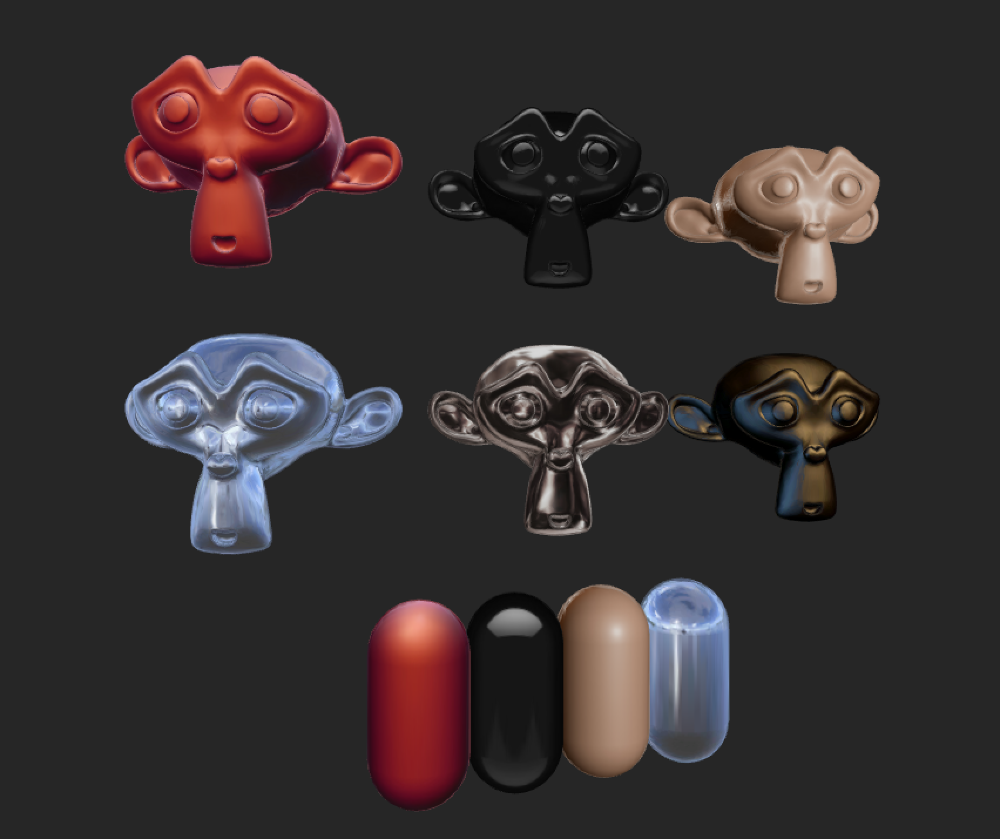

# UnityMatCapShader
http://www.clicktorelease.com/blog/creating-spherical-environment-mapping-shader

http://mua.github.io/matcap-webgl.html 

WebGLで実装してあるこのあたりを参考にUnityのShaderへ。

テクスチャなども上記から。

unity5.0.0f4
